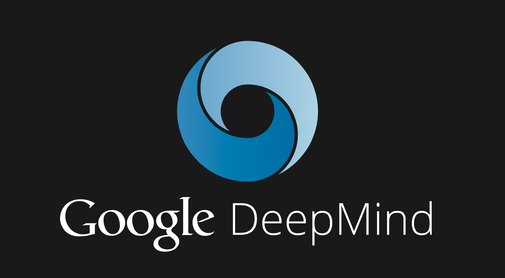
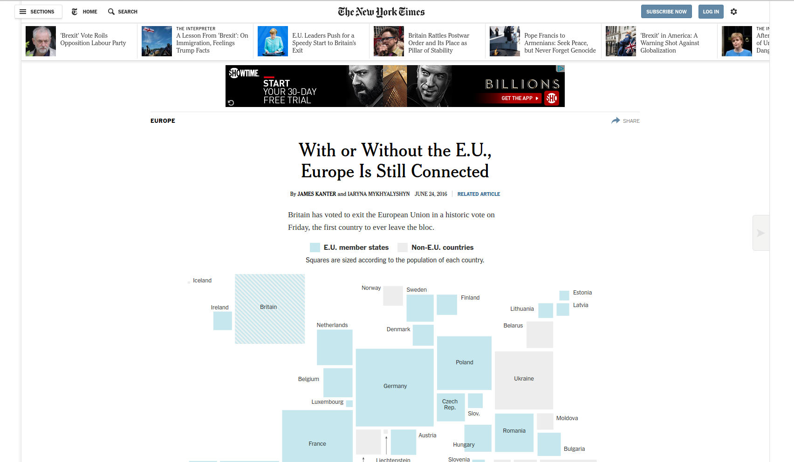
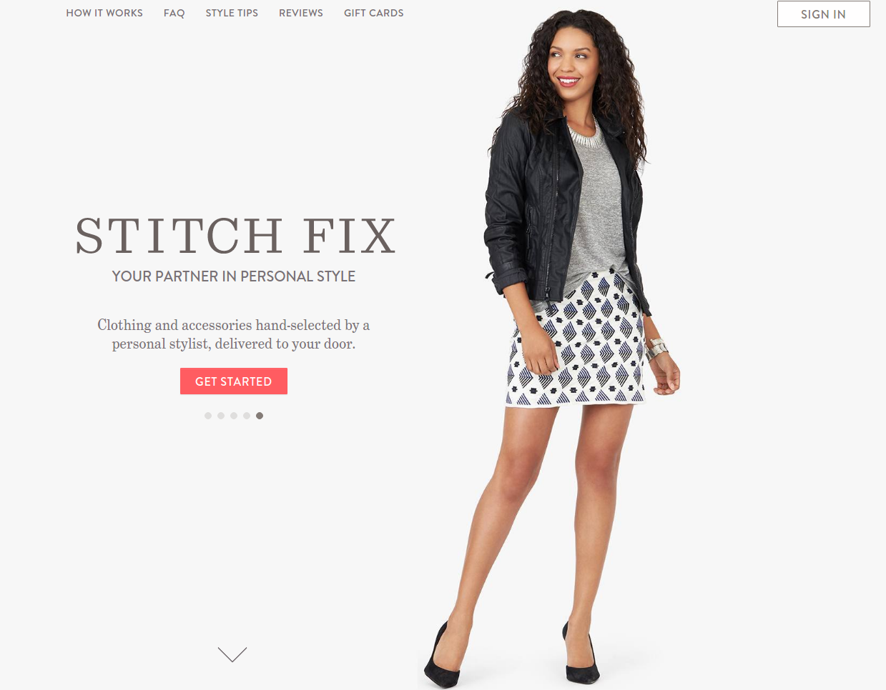

## What do you think of when see you the word 'statistics'?

> - Mean, median, mode?

> - Baseball?

> - Ughhhhh

---  
##  But Statistics is much more!

> - Statistics <-> Machine Learning (Think Google!)

>- Experimental Design

>- Visualizations

>- Analysis

>- Collaboration with other Sciences (and Humanities and even Art!)

>- Programming

# The catch all is "Data Scientist"

--- 
# Google Deep Mind - Artificial Intelligence

---
# Snapchat

---
# New York Times

---
# Stitch Fix

--- 
## This is just the tip of the Iceberg!

"The best thing about being a statistician is that you get to play in everyone's backyard."

- John Tukey

---
# I'm working on predicting the spread of disease

- SPEW - Synthetic Populations and Ecosystems of the World

- Predicting the flu

- Predicting the "next" disease

# All work is collaborative!
Collaborators include:  Professors Bill Eddy, Ryan Tibshirani, Roni Rosenfeld, Sam Ventura, and student Lee Richardson

--- 
## We need more women in statistics and science!

Borrowing from Nature,

> - Women bring different life experiences than men

> - We need to recruit the most talented **people**

> - STEM jobs pay very well and women should have access to those jobs

---
## How can you get more involved with statistics?

> - Math!

> - Programming!

---
## Ok, but how can I get more involved without 10 more years of school?

> Statistical Thinking is more than just crunching the numbers.  It is

> 1. Following through your experiments from beginning to end

> 2. Reasoning about your data to validate assumptions and find explanations, outliers, and flaws

> 3. Visualizing your results in a coherent way

> 4. Presenting your results to others

> 5.  Asking questions about why and how

# You can get started with any one of these steps today!

---
## Additionally, you can start coding today!  It's a lot of fun.

- Collection

- Analysis

- Visualization

# In fact, we will do that now!

